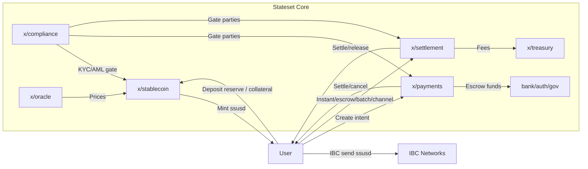

# Stablecoin Payments Network — Architecture Overview

This document gives a high-level view of the Stateset stablecoin payments network: how the native USD stablecoin (`ssusd`) is issued and redeemed, how payments are expressed and settled, and how risk and compliance controls are enforced. For deeper module details, see `docs/settlement-architecture.md` and each module README.

## System At A Glance

Stateset Core is a Cosmos SDK chain providing a native USD stablecoin (`ssusd`) and stablecoin payment rails. The network combines:

- On‑chain stablecoin engine (`x/stablecoin`)
- On‑chain payment intent and settlement rails (`x/payments`, `x/settlement`)
- Risk, price, and compliance controls (`x/oracle`, `x/compliance`)
- Standard Cosmos security and governance (`auth`, `bank`, `staking`, `gov`, `upgrade`, etc.)

### Key Actors

- **Wallet users / payers / payees**: create and settle payments using `ssusd`.
- **Merchants & integrators**: accept `ssusd` and may use escrow, batch settlement, or channels.
- **Validators**: secure the chain with CometBFT consensus.
- **Oracle providers**: submit collateral and reserve asset prices.
- **Compliance operators & governance**: manage KYC status, sanction lists, and risk parameters.
- **Approved attesters**: record off‑chain reserve attestations for reserve‑backed issuance.

## Core On‑chain Components

### Stablecoin Engine (`x/stablecoin`)

Manages issuance and redemption of `ssusd`. Two minting paths exist:

1. **Reserve‑backed issuance (default)**  
   Users deposit approved tokenized reserve assets (for example tokenized treasuries) via `MsgDepositReserve` to mint `ssusd` 1:1, subject to haircuts, allocation caps, and daily limits.

2. **Vault‑based CDPs (optional)**  
   Governance can enable over‑collateralized minting (`vault_minting_enabled=true`). Users open vaults, deposit collateral, mint, repay, and withdraw. Under‑collateralized vaults can be liquidated.

Risk controls live in module parameters:

- Per‑denom collateral or reserve configs
- Global mint/redeem pauses
- Required KYC flags
- Redemption queues and optional delays
- Liquidation ratios and penalties (for CDPs)

Stablecoin operations depend on:

- `x/oracle` for prices
- `x/compliance` for KYC/sanctions gating
- `bank` module for mint/burn and transfers

### Payment Intents (`x/payments`)

Provides a simple intent lifecycle:

- `MsgCreatePayment`: payer escrows funds in the module and creates a `PENDING` intent.
- `MsgSettlePayment`: payee claims escrow and the intent becomes `SETTLED`.
- `MsgCancelPayment`: payer cancels and funds return, the intent becomes `CANCELLED`.

All messages run compliance checks and prevent self‑payments.

### Settlement Rails (`x/settlement`)

Extends payments with richer settlement patterns:

- **Instant transfers** with settlement records (`MsgInstantTransfer`)
- **Escrow settlements** with timeouts and release/refund (`MsgCreateEscrow`, `MsgReleaseEscrow`, `MsgRefundEscrow`)
- **Batch settlements** for aggregated merchant payouts (`MsgCreateBatch`, `MsgSettleBatch`)
- **Payment channels** for off‑chain micro‑payments (`MsgOpenChannel`, `MsgClaimChannel`, `MsgCloseChannel`)

Settlement enforces compliance checks, fee schedules, settlement limits, and expiry handling in EndBlock.

### Compliance (`x/compliance`)

Stores per‑address compliance profiles, sanction lists, and transaction limits. Other modules call into compliance before value movement. Profiles can be `COMPLIANT`, `PENDING`, `BLOCKED`, `SANCTIONED`, or `EXPIRED`.

### Oracle (`x/oracle`)

Maintains on‑chain prices for collateral and reserve assets. Authorized providers submit `MsgUpdatePrice`; the keeper validates deviations and staleness. These prices drive:

- CDP collateral ratios and liquidation triggers
- Reserve haircuts and allocation limits

### Treasury (`x/treasury`)

Collects protocol fees and manages governance‑controlled spending. Fees from settlement and other modules typically route here.

## End‑to‑End Flows

### Reserve‑backed Mint → Payment → Redemption

1. **Mint**
   - User submits `MsgDepositReserve(reserve_asset, amount)` in `x/stablecoin`.
   - `x/compliance` gates the user.
   - `x/oracle` provides the reserve asset price for haircut checks.
   - `ssusd` is minted to the user.

2. **Pay**
   - Payer creates a payment intent (`MsgCreatePayment`) or an instant transfer/escrow in `x/settlement`.
   - Funds are escrowed in module accounts.
   - Compliance checks both parties.
   - Payee settles/claims or escrow conditions release.

3. **Redeem**
   - User submits `MsgRequestRedemption(ssusd)` in `x/stablecoin`.
   - Request may queue if limits or delays apply.
   - `MsgExecuteRedemption` burns `ssusd` and releases the chosen reserve asset.

### CDP Minting (when enabled)

1. `MsgCreateVault` + `MsgDepositCollateral`
2. `MsgMintStablecoin` checks oracle price and collateral ratio.
3. If the ratio falls below the liquidation threshold, anyone can call `MsgLiquidateVault`.

### Batch Settlement (merchant payouts)

1. Merchant or authority creates a batch with multiple intents (`MsgCreateBatch`).
2. Net amounts and fees are computed.
3. Authority executes `MsgSettleBatch` to distribute `ssusd`.

## Cross‑chain & Smart‑contract Integration

- `ssusd` is an IBC‑transferable token using standard ICS‑20 channels.
- Tokenized reserve assets may enter via IBC or bridges, then be deposited into `x/stablecoin`.
- CosmWasm contracts in `cosmwasm/` can create payment intents or escrows, route payments based on on‑chain business logic, and react to settlement events.

## Security & Risk Posture

- **Economic security**: CometBFT + staking; slashing for validator faults.
- **Stablecoin safety**: mint/redeem pauses, daily limits, oracle‑driven haircuts, CDP liquidation parameters.
- **Compliance safety**: sanctions, jurisdiction blocks, per‑address limits.
- **Operational safety**: settlement fee caps, limits, strict input validation, and automatic expiry refunds.
- **Governance**: on‑chain parameter updates for risk, compliance, and module upgrades.

## Architecture Diagram

## Further Reading

- `docs/settlement-architecture.md`
- `x/stablecoin/README.md`
- `x/payments/README.md`
- `x/settlement/README.md`
- `x/compliance/README.md`
- `x/oracle/README.md`
